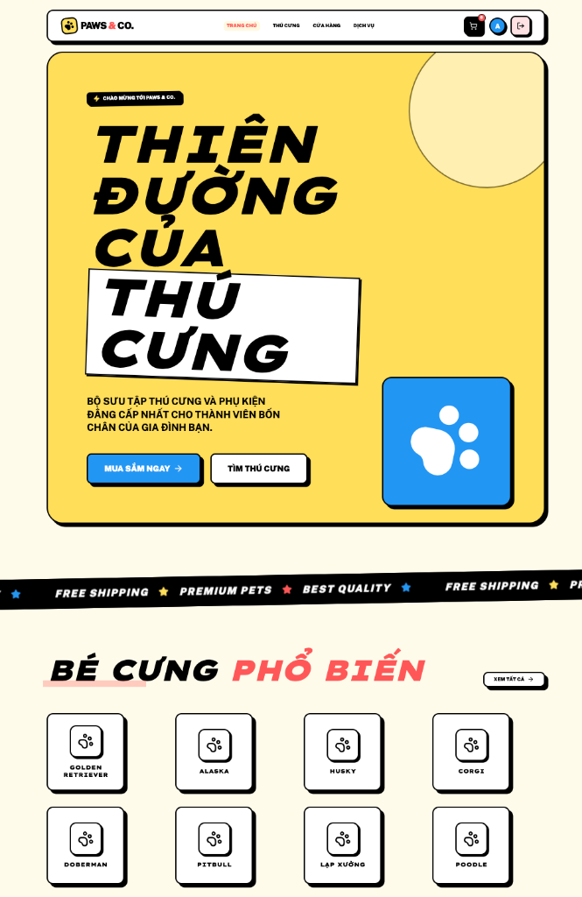
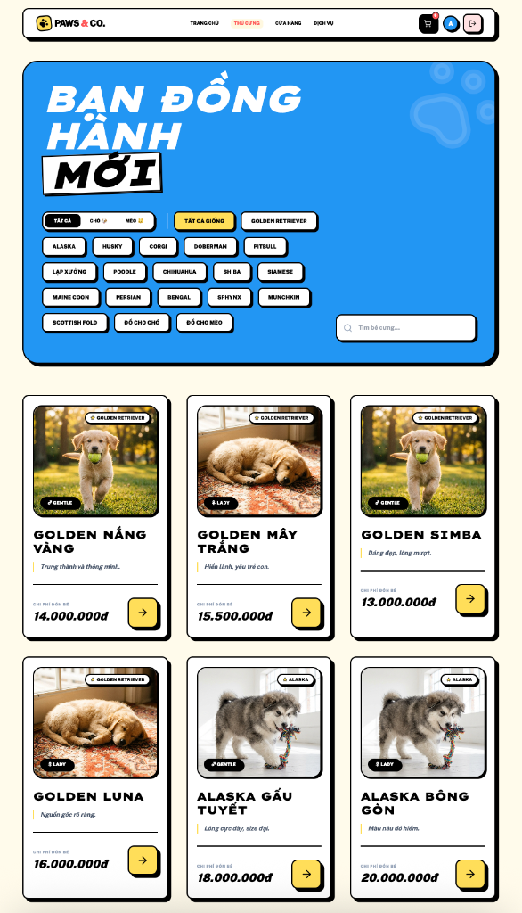
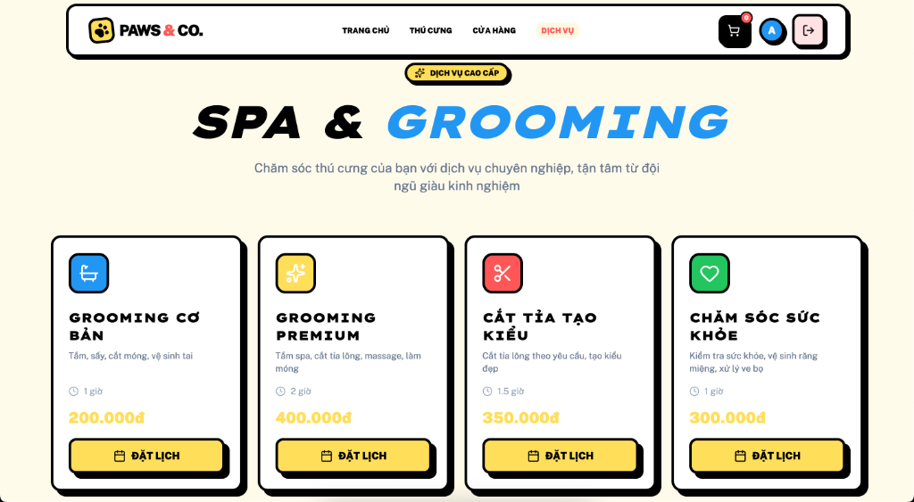
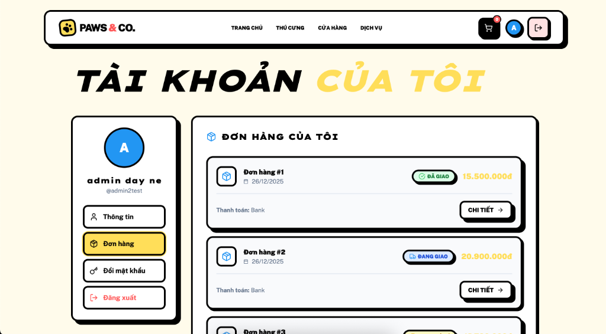
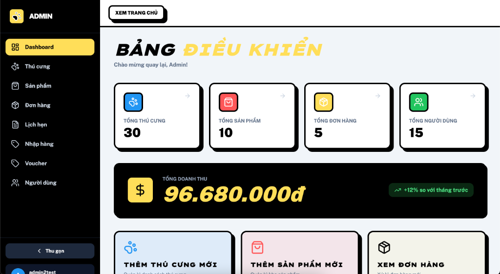

# 🐾 Paws & Co. - Pet Shop

<p align="center">
  
  
  
  
</p>

<p align="center">
  <strong>🛒 Cửa hàng thú cưng trực tuyến hiện đại với đầy đủ tính năng</strong>
</p>

---

## 📸 Preview

### 🏠 Trang Chủ
<p align="center">
  
</p>

### 🐕 Thú Cưng
<p align="center">
  
</p>

### 💆 Dịch Vụ Spa & Grooming
<p align="center">
  
</p>

### 👤 Tài Khoản & Đơn Hàng
<p align="center">
  
</p>

### 📊 Admin Dashboard
<p align="center">
  
</p>

---

## ✨ Tính Năng

### 👤 Người Dùng
| Tính năng | Mô tả |
|-----------|-------|
| 🔐 Đăng ký / Đăng nhập | Xác thực JWT an toàn |
| 🏠 Trang chủ | Hiển thị thú cưng nổi bật, sản phẩm mới |
| 🐕 Thú cưng | Xem danh sách, chi tiết, lọc theo loài |
| 🛍️ Cửa hàng | Sản phẩm thú cưng, phụ kiện |
| 🛒 Giỏ hàng | Thêm, sửa, xóa sản phẩm |
| 💳 Thanh toán | COD & Chuyển khoản ngân hàng |
| 📦 Đơn hàng | Xem lịch sử, chi tiết đơn hàng |
| 👤 Profile | Quản lý thông tin cá nhân |
| 📅 Dịch vụ | Đặt lịch grooming, spa |

### 🔧 Admin
| Tính năng | Mô tả |
|-----------|-------|
| 📊 Dashboard | Thống kê tổng quan |
| 🐾 Quản lý thú cưng | CRUD thú cưng |
| 📦 Quản lý sản phẩm | CRUD sản phẩm |
| 🛒 Quản lý đơn hàng | Xem, cập nhật trạng thái |
| 👥 Quản lý người dùng | Xem danh sách users |
| 🎟️ Quản lý voucher | Tạo, sửa mã giảm giá |
| 📅 Quản lý lịch hẹn | Xem, duyệt lịch hẹn |

---

## 🚀 Cài Đặt & Chạy

### Yêu cầu
- [.NET 8 SDK](https://dotnet.microsoft.com/download/dotnet/8.0)
- [Node.js 18+](https://nodejs.org/)
- [SQL Server](https://www.microsoft.com/en-us/sql-server/sql-server-downloads)

### 1️⃣ Clone repository
```bash
git clone git@github.com:LofizDev/ASP-Pet-website.git
cd ASP-Pet-website
```

### 2️⃣ Cấu hình Database
Sửa connection string trong `appsettings.json`:
```json
{
  "ConnectionStrings": {
    "DefaultConnection": "Server=localhost;Database=PetShopDB;User Id=sa;Password=yourpassword;TrustServerCertificate=True"
  }
}
```

### 3️⃣ Chạy Backend
```bash
dotnet build
dotnet run
```
> 🌐 Backend: http://localhost:5114
> 📖 Swagger: http://localhost:5114/swagger

### 4️⃣ Chạy Frontend
```bash
cd PetShop-Frontend
npm install
npm run dev
```
> 🌐 Frontend: http://localhost:5173

---

## 🏗️ Kiến Trúc

```
📦 PetShop
├── 🔧 Backend (.NET 8 Web API)
│   ├── Controllers/     # API endpoints
│   ├── Services/        # Business logic
│   ├── DTOs/           # Data transfer objects
│   ├── Models/         # Database entities
│   └── Data/           # DbContext
│
└── 🎨 Frontend (React + Vite)
    ├── src/
    │   ├── pages/      # Các trang
    │   ├── components/ # UI components
    │   ├── api/        # Axios services
    │   └── context/    # React Context
    └── public/
```

---

## 🛠️ Tech Stack

| Layer | Technologies |
|-------|-------------|
| **Frontend** | React 18, Vite, TailwindCSS, React Query, React Router |
| **Backend** | .NET 8, ASP.NET Core Web API, Entity Framework Core |
| **Database** | SQL Server 2022 |
| **Auth** | JWT Bearer Token |

---

## 📞 API Endpoints

| Method | Endpoint | Mô tả |
|--------|----------|-------|
| POST | `/api/Authenticate/login` | Đăng nhập |
| POST | `/api/Authenticate/register` | Đăng ký |
| GET | `/api/DogItems/get-all-dogs` | Lấy danh sách thú cưng |
| GET | `/api/DogProductItem/get-all-dog-product-admin` | Lấy sản phẩm |
| POST | `/api/Checkout/create` | Tạo đơn hàng |
| GET | `/api/Checkout/list/{email}` | Lịch sử đơn hàng |

---

## 📄 License

MIT License - Tự do sử dụng và chỉnh sửa.

---

<p align="center">
  Made with ❤️ using React & .NET
</p>
